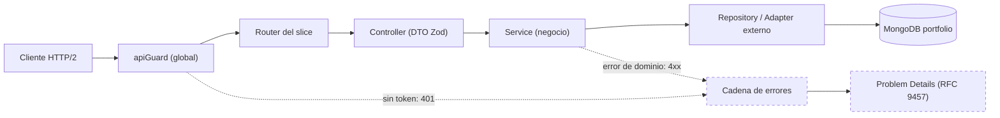

<div align="center">

# backend-portfolio-new

**Backend de [jmrg.dev](https://jmrg.dev)** — API REST sobre Fastify 5 (HTTP/2), Mongoose 9 y Emmett (CQRS lite).

Migración del portfolio original (Next.js + tRPC + Prisma) a REST sobre la **misma** MongoDB, sin migración de datos.

`Node ≥24` · `TypeScript 6` · `Fastify 5` · `Mongoose 9` · `Emmett` · `Zod 4` · `pnpm 11` · `100 tests ✓`

</div>

---

## Filosofía

Un API es **request → response**: un flujo lineal, sin sobre-ingeniería, sin capas de paso vacías. Emmett aporta CQRS/workflows/eventos **cuando lo justifican**. Los patrones se usan **declarados y reutilizables**, no implícitos. Lo que no se usa, se elimina.

## Stack

| Capa | Tecnología |
|---|---|
| **Runtime** | Node ≥ 24, ESM puro |
| **HTTP** | Fastify 5 (HTTP/2: TLS+ALPN o h2c) · Helmet · CORS · Compress |
| **Datos** | MongoDB 8 (replica set) vía Mongoose 9 |
| **Dominio** | Emmett 0.42 (CQRS lite) · Zod 4 (validación) |
| **Auth** | Clerk (`@clerk/fastify`) — API privada con allowlist de admin |
| **Almacenamiento** | S3 (`@aws-sdk`) — OVH / AWS / MinIO |
| **Lenguaje/tooling** | TypeScript 6 (strict máx.) · ESLint 10 · Prettier 3 · Vitest 4 · Vite 8 · pnpm 11 |

*Planificadas y cableables al implementar su slice*: `ioredis` (caché Valkey + rate-limit), `mailtrap` (contact), `winston`+`winston-loki` (Loki), `sharp` (imágenes).

## Arquitectura

**Screaming Architecture** + **Clean Architecture** + **CQRS lite**. La dependencia apunta siempre hacia dentro: `presentation → domain ← infrastructure`.



El **use-case** entra solo en workflows multi-paso; los errores **nunca** se capturan en el flujo: suben a una cadena de responsabilidad global → **Problem Details (RFC 9457)** con `x-request-id`.

Detalle: [docs/architecture.md](./docs/architecture.md).

## Quick start

```bash
pnpm install                              # deps (versiones exactas, pnpm obligatorio)
docker compose up -d                      # MongoDB local (replica set rs0)
cp .env.example .env.local                # y rellena las variables requeridas
pnpm dev                                  # tsx watch → https://localhost:3000
```

```bash
curl -sk --http2 https://localhost:3000/api/health
# {"status":"ok","service":"backend-portfolio","timestamp":"...","uptime":...}
```

> Para HTTPS local necesitas certificados autofirmados (o hablarás h2c, que los navegadores no soportan). Pasos completos en [docs/getting-started.md](./docs/getting-started.md).

## Comandos

| Comando | Qué hace |
|---|---|
| `pnpm dev` | Servidor en watch (`tsx`). |
| `pnpm build` / `pnpm start` | Build (Vite) / ejecutar el build. |
| `pnpm typecheck` | `tsc --noEmit` — **0 siempre**. |
| `pnpm lint` / `pnpm lint:fix` | ESLint 10 + typescript-eslint — **0 siempre**. |
| `pnpm test` / `pnpm test:watch` | Suite funcional (Vitest + `app.inject`). |
| `pnpm format` | Prettier. |

## Estructura

```
src/
├── main.ts · config/            # entry + entorno validado (Zod, fail-fast)
├── core/{adapters,helpers,types}/
├── domain/                      # entities · types · dtos · shared (sin frameworks)
├── infrastructure/
│   ├── dbs/{config,models,repositories}/
│   └── external-services/{clerk,s3,mailtrap}/
└── presentation/
    ├── bootstrap/               # app · server · routes · middlewares + cadena de errores
    └── {blog,projects,cms,storage,dashboard,auth,users}/
```

## Documentación

| Documento | Contenido |
|---|---|
| [getting-started](./docs/getting-started.md) | Requisitos, setup (Docker, certs, `.env`), comandos. |
| [architecture](./docs/architecture.md) | Screaming + Clean + CQRS lite, flujo canónico, composición. |
| [api-reference](./docs/api-reference.md) | Contrato de rutas (servicio / admin), auth, paginación. |
| [data-model](./docs/data-model.md) | Entidades, colecciones, índices, gotchas de Mongoose. |
| [error-handling](./docs/error-handling.md) | Cadena de responsabilidad → Problem Details (RFC 9457). |
| [security](./docs/security.md) | `apiGuard` / `adminGuard`, Clerk, secretos, TLS. |
| [testing](./docs/testing.md) | TDD, Vitest + `app.inject` contra la Mongo real. |
| [patterns](./docs/patterns.md) | Patrones de diseño declarados en uso. |
| [roadmap](./docs/roadmap.md) | Estado de la migración y pendientes. |

## Estado

Slices de **lectura** (`blog`, `projects`, `cms`) + `storage`, `dashboard`, `auth` y `users` implementados y verificados (en vivo y con **100 pruebas funcionales**). **CRUD admin de blog** operativo. Auth (API privada + admin endurecido) operativa. Pendiente: CRUD de projects/cms con espejado ES↔EN, contact, caché Valkey, logging Loki. Ver [roadmap](./docs/roadmap.md).

---

<div align="center">
<sub>Portfolio de <strong>JMRG</strong> · <a href="https://jmrg.dev">jmrg.dev</a></sub>
</div>
