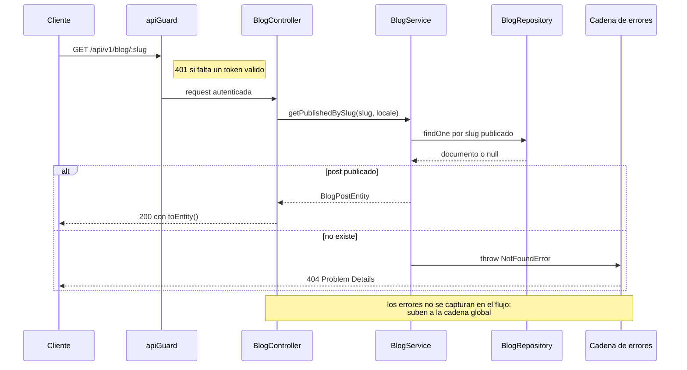

# Arquitectura

**Screaming Architecture** + **Clean Architecture** + **CQRS lite** (Emmett). La premisa: un API es *request → response*, un flujo lineal sin sobre-ingeniería ni capas de paso vacías. Los patrones se usan **declarados y reutilizables**, nunca implícitos; lo que no se usa, se elimina.

## Principio de dependencia

La dependencia apunta **siempre hacia dentro**:

```
presentation  ──▶  domain  ◀──  infrastructure
```

`domain` no importa de Fastify, Mongoose ni ioredis: solo conoce interfaces que la propia app define. Las implementaciones concretas (HTTP, base de datos, proveedores externos) viven en los anillos externos y se inyectan.

## Flujo canónico de una petición

```
main
 └─ server            (protocolo HTTP/2: TLS+ALPN con certs · h2c sin ellos)
     └─ app           (plugins: helmet, cors, compress · apiGuard global · cadena de errores)
         └─ routes    (bootstrap: monta cada RouteModule del slice)
             └─ router del slice        (COMPOSITION ROOT: DI + middlewares locales)
                 └─ controller          (DTO Zod de entrada · Entity de salida · SIN lógica)
                     └─ service          (negocio)
                         ├─ use-case      (SOLO workflows multi-paso)
                         └─ repository    (Mongo/Valkey) | adapter externo (S3, Clerk, Mailtrap)
                     ◀── return al controller
```

- El camino corto **`controller → service → repository`** es el default.
- El **use-case** entra solo cuando hay un workflow multi-paso (espejado de locales ES↔EN, contacto: rate-limit → Turnstile → email). Nunca un passthrough 1:1.
- Si un service solo delegaría 1:1 en un adapter externo (caso `storage`), **el controller consume directamente la interfaz del adapter** — sin capa vacía.
- Los **errores nunca se capturan en el flujo**: suben a la cadena global (ver [error-handling.md](./error-handling.md)).

### El flujo en el tiempo (lectura por slug)



## Estructura de carpetas (Screaming)

```
src/
├── main.ts                     # entry: TZ → conexiones → server → listen
├── config/                     # entorno validado con Zod (fail-fast) + timezone
├── core/
│   ├── adapters/               # envoltorios de librerías transversales (time, console-logger)
│   ├── helpers/                # utilidades globales puras (startup-time)
│   └── types/                  # augmentations de Fastify (request.caller, request.pagination)
├── domain/                     # ANILLO INTERNO — sin dependencias de frameworks
│   ├── entities/<entidad>/     # interfaz I<X> (se inyecta al modelo) + clase con toEntity()/toEntityMap()
│   ├── types/<entidad>/        # CreateXData / UpdateXData / opciones (opcionales como T | undefined)
│   ├── dtos/<entidad>/         # clases DTO: schema Zod privado + fromRequest()
│   └── shared/                 # BaseEntity, errors (ProblemDetails), logger (puerto), pagination
├── infrastructure/
│   ├── dbs/
│   │   ├── config/mongodb/     # DatabaseConnector (fachada) + eventos de conexión
│   │   ├── models/mongodb/<e>/ # factory de modelo por Connection sobre Schema<I<X>>
│   │   └── repositories/       # bases abstractas (BaseRepository, LocaleSingleton, PublishedByLocale)
│   └── external-services/      # adapters de proveedores: clerk · s3 · mailtrap
│                               #   (la librería del proveedor SOLO se importa aquí)
└── presentation/
    ├── bootstrap/              # app · server · routes · controllers base · middlewares + cadena de errores
    └── <recurso>/              # slices HTTP: routes · controllers · services · repositories
                                #   interfaces en types.ts POR SUBCARPETA · barrels index.ts SIEMPRE
```

### Naming

- **Dominio**: por entidad, en **singular** (`entities/project`, `entities/hero-content`).
- **Presentación**: por **recurso HTTP** (`projects`, `cms`, `storage`).
- Ficheros kebab-case con sufijo de rol: `*.entity.ts`, `*.model.ts`, `*.repository.ts`, `*.service.ts`, `*.controller.ts`, `*.routes.ts`, `*.usecase.ts`, `*.dto.ts`, `*.types.ts`, `*.adapter.ts`, `*.middleware.ts`.
- **Barrels `index.ts`** en cada carpeta exportable. Imports entre módulos por barrel y alias (`@domain/*`, `@infrastructure/*`, `@presentation/*`, `@core/*`, `@config/*`); dentro del mismo módulo, relativos.

## Composición (sin contenedor DI)

Dos niveles:

1. **`bootstrap/`** monta la app y la lista de `RouteModule[]`.
2. **El router de cada slice es el composition root del módulo**: construye la cadena `model(db) → repository → service → use-cases → controller` e inyecta por constructor (`private readonly`) contra las **interfaces** de los `types.ts` de cada subcarpeta.

No hay contenedor DI ni decoradores mágicos: la composición es explícita y localizada.

## Entidad = interfaz + clase pura

Cada entidad es **una** interfaz `I<X>` que se inyecta directamente al modelo Mongoose (`Schema<I<X>>`), más una clase pura con `toEntity()` / `toEntityMap()`. Todas extienden `BaseEntity<TProps>` (en `domain/shared/entities`), que hereda esos métodos; solo se sobrescribe `toEntity()` en entidades con arrays (blog `tags`, project `tech`, experience `tasks`).

El documento de Mongoose **no sale** del repositorio: se lee con `.lean<TDoc>()` y se mapea a entidad con `toDomain()`.

## CQRS lite

Emmett aporta hoy la **separación commands/queries** y un **vocabulario de errores de dominio** (`NotFoundError`, `ValidationError`, `ConcurrencyError`…). El decider, el event store y las proyecciones se activarán de forma **selectiva** cuando un caso lo justifique (el primer candidato es `dashboard.recentActivity` como read model). No se paga la complejidad de event sourcing donde un CRUD basta.

## Helper vs Adapter (distinción arquitectónica)

La diferencia está en **hacia dónde apuntan las dependencias**:

- **Adapter** (`core/adapters/` para librerías transversales; `external-services/` para proveedores) = **escudo/frontera** (DIP + OCP). El dominio conoce un contrato propio; el adapter lo implementa y por debajo habla con la librería externa. Flujo: `negocio → interfaz propia ← adapter → librería externa`. Si el proveedor cambia, solo cambia el adapter.
- **Helper** (`core/helpers/`) = **utilitario** (DRY). Tarea técnica pequeña y repetida, centralizada. Flujo: `negocio → helper genérico`. No transforma interfaces; ejecuta entrada→salida y se mantiene trivial y puro.

Criterio: *¿protege al núcleo de un sistema externo transformando su interfaz?* → Adapter. *¿centraliza una tarea genérica interna?* → Helper.

## Reglas duras

- **Lo que no se usa se elimina**: cero código muerto, cero placeholders, cero specs especulativas. Las carpetas nacen con su primer fichero real, nunca vacías.
  - *Excepción*: las dependencias del `package.json` son el mapa del plan y **no se eliminan sin confirmación del owner**.
- **Sin `any`** → `unknown` + narrowing. Sin `as` ni `!` no justificados (un cast permitido va localizado y explicado en el JSDoc del símbolo).
- **TDD**: cada endpoint/guard llega con su prueba funcional. `pnpm test` verde es requisito de cierre igual que typecheck y lint en 0.
- Colecciones e índices **idénticos** al `schema.prisma` del portfolio original (ver [data-model.md](./data-model.md)).

Plantilla canónica de slice: **`blog`**. Patrones concretos en [patterns.md](./patterns.md).
