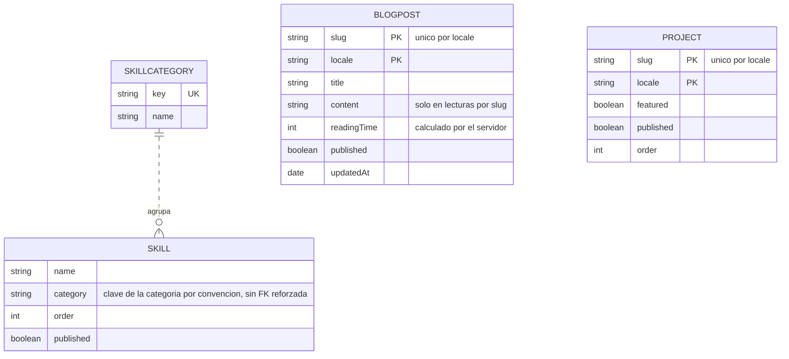

# Modelo de datos

El backend lee **las mismas colecciones** que el portfolio original (tRPC + Prisma). Colecciones e índices se calcan del `schema.prisma` viejo, verificados contra el fichero — **no hay migración de datos**.

## Entidad → modelo → colección

Cada entidad de dominio es **una** interfaz `I<X>` (en `domain/entities/<entidad>/`) que se inyecta directamente al `Schema<I<X>>` de Mongoose. La factory de modelo (en `infrastructure/dbs/models/mongodb/<entidad>/`) crea el modelo sobre una `Connection` concreta.

| Entidad | Colección | Índices | Ruta expuesta |
|---|---|---|---|
| `BlogPost` | `blogposts` | **único** `slug + locale` | ✅ blog |
| `Project` | `projects` | **único** `slug + locale` · `published + locale` · `featured` · `order` | ✅ projects |
| `SiteSettings` | `sitesettings` | **único** `locale` | ✅ cms |
| `HeroContent` | `herocontents` | **único** `locale` | ✅ cms |
| `AboutContent` | `aboutcontents` | **único** `locale` | ✅ cms |
| `Skill` | `skills` | `category + order` | ✅ cms |
| `Experience` | `experiences` | **único** `locale + company` · `locale + published + order` | ✅ cms |
| `Testimonial` | `testimonials` | **único** `locale + author` · `locale + published + order` | ✅ cms |
| `SkillCategory` | `skillcategories` | **único** `key` | — (solo entidad + modelo; el viejo no la expone) |

Los índices se crean automáticamente con `autoIndex` **solo fuera de producción** (`main.ts` lo activa según entorno).

### Contenido localizado y skills compartidas



## Particularidades

- **Multi-idioma por documento**: el contenido se duplica por `locale` (`es` / `en`). No hay una tabla de traducciones; cada locale es un documento con su propio `slug`/`locale` (de ahí los índices únicos compuestos).
- **Singletons por locale** (`sitesettings`, `herocontents`, `aboutcontents`): un documento por idioma. Timestamps `{ createdAt: false, updatedAt: true }` (paridad con el Prisma viejo). Un singleton inexistente se sirve como `null` con `200`, no como `404`.
- **`AboutContent`** guarda `eduContent`, `philContent` y `facts` como **cadenas JSON** (igual que el viejo).
- **`Skill`** es compartida entre idiomas (no lleva `locale`); se filtra por `category` y `published`.
- **Clave primaria**: el `_id` (ObjectId) de Mongo se normaliza a `string` una única vez en `BaseRepository.toDomain()` y se sirve como **`_id`** (ver [api-reference.md](./api-reference.md)).

## Acceso a datos

El documento de Mongoose **no sale** de la capa de repositorio:

```
model.find(...).lean<TDoc>()   →   toDomain(doc)   →   Entity
```

- `BaseRepository<TDoc, TEntity, TCreate>` resuelve CRUD, paginación y conteo; `toDomain` normaliza `_id` y delega en la factory abstracta `buildEntity(props)` que cada repo implementa en una línea.
- Bases especializadas reutilizables:
  - `LocaleSingletonRepository` → `findByLocale()` para los singletons.
  - `PublishedByLocaleRepository` → `findPublished()` (filtra `locale + published`, ordena por `order`).
- Los **listados sirven proyección meta** (`projection: { content: 0 }`): sin el cuerpo pesado, como el `select` del viejo. `content` solo viaja en las lecturas por slug.

## Gotchas de Mongoose 9 (ESM)

Verificados en runtime, no negociables:

- Los `.d.ts` **mienten** sobre los named exports: en runtime ESM solo existen como **valores** `Schema`, `Types`, `model`… y el default. `Connection`, `Model`, `QueryFilter`, `UpdateQuery`, `AnyKeys`, `SortOrder` **no** existen como named export → siempre `import type`. Los valores restantes se acceden por el default (`mongoose.mongo.MongoServerError`, `mongoose.Error.CastError`).
- Mongoose 9 **eliminó `FilterQuery`**: el tipo de filtro es `QueryFilter<T>`.
- `tsc` **no** detecta el problema de los named exports (`verbatimModuleSyntax` preserva los imports): compila y peta en runtime. Verificar ante la duda:
  ```bash
  node -e "import('mongoose').then(m => console.log(Object.keys(m)))"
  ```

## Datos de ejemplo (seed local)

Portados de los seeds del viejo vía `mongosh` en el contenedor:

- **2** posts de blog (`hola-mundo` es, `hello-world` en)
- **6** projects · **41** skills · **12** experiences · **4** testimonials
- singletons `es`/`en` de site-settings, hero y about
- **6** skill categories
