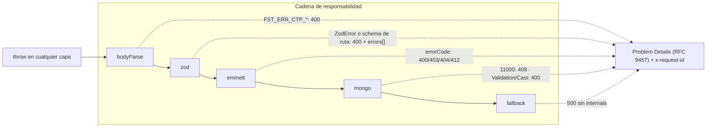

# Manejo de errores

Un único principio: **los errores nunca se capturan en el flujo**. No hay `try/catch` en controllers ni services; cualquier `throw` sube hasta el error handler global de Fastify, que lo resuelve con una **cadena de responsabilidad** hacia **Problem Details (RFC 9457)**.



`try/catch` passthrough (`catch (e) { throw e }`) está **prohibido**. Solo se captura para **enriquecer y relanzar**, o en los adapters de auth (que mapean los throws del proveedor a identidad ausente).

## La cadena (Chain of Responsibility)

En `presentation/bootstrap/middlewares/errors/`. Cada eslabón decide si el error es suyo; si no, delega en el siguiente.

| Orden | Eslabón | Reconoce | Responde |
|---|---|---|---|
| 1 | **bodyParse** | `FST_ERR_CTP_*` (body malformado) | `400` |
| 2 | **zod** | `ZodError` (falla un DTO) **o** el error de validación del schema Zod declarado en la ruta (`fastify-type-provider-zod`) | `400` con `errors[]` (campo + mensaje), idéntico en ambas fronteras |
| 3 | **emmett** | errores de dominio de Emmett | el `errorCode` **es** el status: `400/403/404/412` |
| 4 | **mongo** | errores de MongoDB | `11000` → `409` (con el campo) · `ValidationError` → `400` · `CastError` → `400` |
| 5 | **fallback** | cualquier otro | `500` **sin filtrar internals** |

- **Template Method** en la base `ErrorHandler`: `setNext()` / `delegate()` / `respond()`. `respond()` añade `x-request-id` y `content-type: application/problem+json`.
- `ConcurrencyError` de Emmett añade `current` / `expected` al cuerpo.
- El `409` de **slug duplicado** sale directamente del **índice único de Mongo** — sin comprobaciones manuales en el service.
- El `500` de fallback **jamás** filtra stack, mensajes internos ni datos de conexión.

## Forma de la respuesta (RFC 9457)

```jsonc
{
  "type": "about:blank",
  "title": "Not Found",
  "status": 404,
  "detail": "Post no encontrado",
  "instance": "/api/v1/blog/inexistente"
}
```

Cabeceras: `content-type: application/problem+json` + `x-request-id` (correlación con los logs).

## Vocabulario de dominio (Emmett)

Los errores de negocio usan el vocabulario de Emmett, **nunca** `throw new Error('texto')` como contrato:

```ts
throw new NotFoundError({ id, type, message: 'Post no encontrado' });
```

Esto mantiene el `errorCode` como fuente del status HTTP y desacopla el dominio del transporte: el service lanza semántica de negocio; la cadena la traduce a HTTP.

## Logging de errores

`ErrorLogger` (con `chalk`) clasifica por color y recibe el `LoggerPort` inyectado:

- `4xx` → amarillo (`warn`)
- `5xx` → rojo (`error`)
- errores de Mongo → cyan
- no clasificados → magenta

Correlaciona cada log con el `x-request-id` de la respuesta.

## Reglas para el desarrollador

- **No captures** en el flujo. Lanza el error de dominio adecuado y deja que la cadena responda.
- Para un caso nuevo, **añade un eslabón** a la cadena (o amplía uno existente) — no metas lógica de HTTP en el service.
- La validación de entrada es responsabilidad del **DTO** (Zod): un input inválido lanza `ZodError` → `400` automático.
- Ver también: [security.md](./security.md) (los guards mapean todo throw de verificación a `401`/`403`, nunca `500`).
