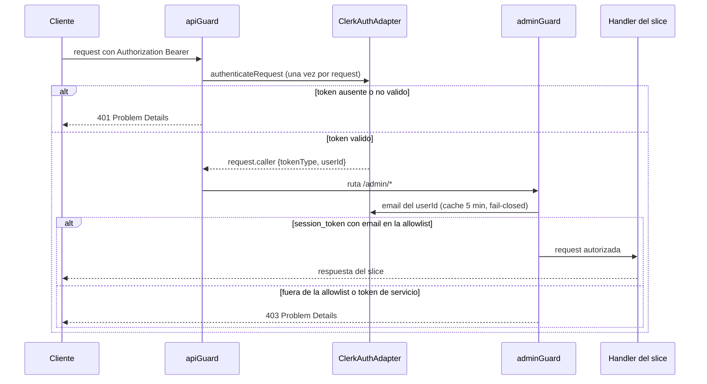

# Seguridad

## API completamente privada

Decisión del owner: **toda** la API exige un token Clerk válido. El `apiGuard` es un hook `onRequest` **global** construido con una factory (`buildApiGuard(authAdapter)`) sobre un `ClerkAuthAdapter` compartido.

- Acepta tres tipos de token: **`session_token`** (admin), **`api_key`** y **`m2m_token`** (frontend/servicios).
- **Exentos**: `GET /api/health` y `OPTIONS` (preflight CORS). Solo en **desarrollo**, también `GET /auth/dev-token` (emite un token real de pruebas; la ruta no se monta en producción).
- Verifica **una vez** por request y cuelga la identidad en **`request.caller`** (`{ tokenType, userId }`, augmentation en `core/types/fastify.d.ts`).
- Sin token válido → `401 'No estas autenticado'`.

El frontend consume la API con un token de servicio (API key / m2m).

## Administración endurecida

El `adminGuard` **reutiliza** `request.caller` (sin doble verificación) y exige:

1. `tokenType === 'session_token'` (una sesión de usuario real), **y**
2. email principal dentro de `ADMIN_EMAIL_ALLOWLIST`.

Fuera de la allowlist → `403 'Acceso restringido a administradores'`. Las API keys y los tokens m2m **nunca** administran.

### Flujo de una petición admin

- `ADMIN_EMAIL_ALLOWLIST` (default `info@jmrg.dev,@jmrg.dev`): las entradas `@dominio` autorizan el dominio completo; el resto exige el email exacto.
- El email se obtiene vía **Backend API de Clerk** con **caché en memoria de 5 min** por `userId`, **fail-closed** (fallo del proveedor → `403`, nunca se abre).
- El **registro está cerrado** en el dashboard de Clerk (sign-up desactivado; único usuario `info@jmrg.dev`).

> Este endurecimiento **supersede** la paridad con el viejo, donde admin era *cualquier* usuario autenticado (`isAuthenticated` solo comprobaba `userId != null`, sin roles ni allowlist).

## Aislamiento del proveedor

La librería de Clerk **solo** se importa en `infrastructure/external-services/clerk` (`ClerkAuthAdapter`). Los guards y el resto del código consumen la **interfaz** por DI. Todo throw de verificación se mapea a `401`/`403` — **nunca** `500`.

### Gotchas de `@clerk/fastify` (por qué el guard es como es)

- `clerkPlugin` **global** revienta este backend: su `fastifyRequestToRequest` copia `req.headers` a `Headers` del estándar Fetch, y los **pseudo-headers HTTP/2** (`:method`, `:path`, `:authority`, `:scheme`) son nombres inválidos → `TypeError` → `500` en todas las rutas. Por eso **no** hay plugin global: el guard llama a `authenticateRequest` **dentro**, reconstruyendo la Request y **filtrando los pseudo-headers `:*`**.
- `decodeJwt` de `@clerk/backend` hace `JSON.parse` sin capturar: un `Bearer` malformado lanza `SyntaxError`. Por eso el guard captura **cualquier** throw y responde `401`.
- Las rutas **exentas (`/api/health`, `OPTIONS`) no tocan Clerk** (el guard las deja pasar).

## Validación de entrada

- Todo input externo pasa por una **clase DTO** (`fromRequest()`, Zod) en el controller. Nada de `request.body as X` ni validación ad-hoc.
- Un input inválido lanza `ZodError` → `400` por la cadena de errores.

## Secretos

- Nunca en código, logs ni commits. Los ficheros `.env*` están **denegados a las herramientas** (`settings.json`) y gitignorados; la plantilla es `.env.example` con placeholders.
- El loader lee `.env.${NODE_ENV}`.
- Si un secreto se expone, **rotarlo** en el proveedor (Clerk / S3 / Mailtrap).
- `certs/` (autofirmados, **solo** desarrollo) está gitignorado; los certificados reales los gestiona el despliegue.

## HTTP

- **`@fastify/helmet`** + **`@fastify/cors`** con allowlist desde `env.server.corsOrigins` (nunca `origin: true` en producción). `bodyLimit` configurado.
- **HTTP/2 en dos modos** (`server.ts`):
  - Con `TLS_CERT_PATH` + `TLS_KEY_PATH` → **HTTPS + ALPN** (`h2` con fallback `http/1.1`). Para navegadores y despliegue con cert propio.
  - Sin certs → **h2c** (cleartext), **solo** para local-cli o detrás de Traefik interno. Los navegadores no hablan h2c.

## Rate-limit y caché (contrato heredado)

- Rate-limit de contacto: **ventana fija** `ratelimit:{ip}`, **5 req / 3600 s**, sobre ioredis (Valkey). No implementar contadores caseros ni cambiar a sliding sin decisión del owner.
- El contrato de claves y TTLs de caché está definido en la documentación interna del proyecto.

## Puntos conscientes

- **`GET /storage/download-url`**: el endpoint exige token como el resto; la **URL presigned** que devuelve (1 h) la usa quien la posea. Mantenerlo presente.
- Mongo en producción: usuario de permisos mínimos y `authSource` explícito; sin credenciales en URIs commiteadas. El compose local (`rs0` sin auth) es **solo** para desarrollo.
- Nuevas dependencias requieren confirmación del owner (el `package.json` es el mapa del plan).
